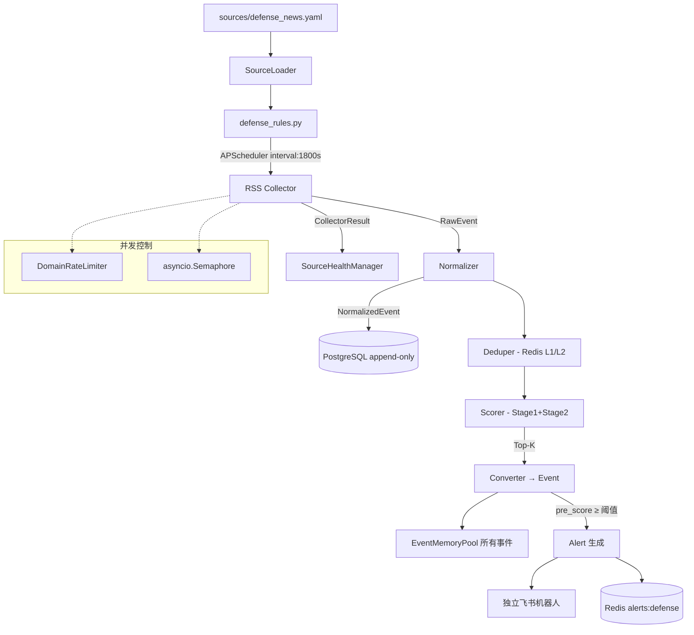

# 技术设计文档 — 防务资讯采集管线（修订版）

## 0. Phase 1 目标统一

**混合模式**：事件写入记忆池参与关联推理 + 对高分事件产出 Alert 并推送独立飞书机器人，低分事件只入池不推送。

```
NormalizedEvent
  → PG 落库 (append-only, 去重前)
  → Redis L1/L2 去重
  → Stage 1 硬过滤 + Stage 2 规则打分
  → Top-K 截断
  → Converter → Event
  → EventMemoryPool (所有通过 Stage 2 + Top-K 的事件)
  → pre_score ≥ 阈值 → Alert → 独立飞书推送
```

这与 defense-integration-plan.md 的 memory-first 策略兼容（通过过滤的事件都入池），同时满足 requirements.md 的飞书推送需求（高分事件产出 Alert）。

**基线文档同步**：`docs/defense-integration-plan.md` 的 Phase 1 范围需同步更新为混合模式——"memory-first + selective alert"，删除原文中"Phase 1 不直接发 alert"和"Phase 1 不做独立 defense alert 卡片"的约束。此变更将在实现阶段（任务 1）中完成。

## 1. 架构概览



## 2. 技术栈与选型

| 组件 | 选型 | 说明 |
|------|------|------|
| RSS 解析 | feedparser 6.x | 成熟稳定，支持 RSS 2.0 / Atom |
| HTTP 客户端 | httpx (已有) | 异步，支持 ETag/Last-Modified |
| YAML 解析 | PyYAML 6.x | **显式声明依赖**，不依赖传递 |
| 数据校验 | Pydantic v2 (已有) | SourceSpec 模型校验 |
| PostgreSQL 驱动 | asyncpg | 原生异步，性能最佳 |
| 定时调度 | APScheduler (已有) | 复用现有调度基础设施 |

新增依赖（pyproject.toml）：`feedparser>=6.0.0`、`asyncpg>=0.29.0`、`pyyaml>=6.0.0`

## 3. 新增/修改文件清单

### 新增文件

| 文件 | 模块 | 职责 |
|------|------|------|
| `app/defense/__init__.py` | — | 包初始化 |
| `app/defense/models.py` | M1 | RawEvent, NormalizedEvent (dataclass) + SourceSpec (Pydantic) + CollectorResult |
| `app/defense/source_loader.py` | M2 | YAML 加载、校验、冲突检测 |
| `app/defense/collectors/__init__.py` | — | 包初始化 |
| `app/defense/collectors/rss.py` | M3 | RSS 采集器 |
| `app/defense/collectors/registry.py` | M4 | 采集器注册表 |
| `app/defense/normalizer.py` | M5 | RawEvent → NormalizedEvent |
| `app/defense/deduper.py` | M6 | Redis 双层去重 |
| `app/defense/scorer.py` | M7 | Stage 1 + Stage 2 |
| `app/defense/rate_limiter.py` | M8 | 域名级限速器 |
| `app/defense/converter.py` | M9 | NormalizedEvent → Event |
| `app/defense/storage.py` | M13 | asyncpg CRUD |
| `app/defense/health.py` | — | SourceHealthManager 状态机 |
| `app/rules/defense_rules.py` | M10 | 防务采集规则 |
| `sources/defense_news.yaml` | M11 | 种子源配置 |

### 修改文件

| 文件 | 变更内容 |
|------|---------|
| `app/models.py` | 新增 `SourceType.DEFENSE` |
| `app/config.py` | 新增防务配置项 + PG 配置项 + 防务飞书 Webhook |
| `app/engine/context.py` | RuleContext 新增 `app_state` 可选字段 |
| `app/main.py` | lifespan 中初始化 PG + defense delivery；execute_rule 注入 app_state |
| `app/routes/debug.py` | execute_rule 调用同步更新；新增 defense health/runs 端点 |
| `app/delivery/feishu.py` | 新增 `_format_defense_card()` |
| `pyproject.toml` | 新增 feedparser、asyncpg、pyyaml 依赖 |

## 4. 运行时依赖注入方案

### 4.1 问题

现有 `RuleContext` 只有 `data/ai/db/config/delivery/logger`。defense 规则额外需要 PG 连接池和独立 delivery。

### 4.2 方案：扩展 RuleContext 添加 app_state 字段

```python
@dataclass
class RuleContext:
    data: dict
    ai: AIClient
    db: Redis
    config: RuleConfig
    delivery: BaseDelivery
    logger: logging.Logger = field(default_factory=lambda: logging.getLogger("rule"))
    app_state: Any = None  # 新增：传入 app.state，规则按需取用
```

- `app_state` 类型为 `Any`（实际是 `Starlette.State`），避免引入循环依赖
- 现有规则不受影响（不访问 `app_state`）
- defense 规则通过 `ctx.app_state.pg_pool` 和 `ctx.app_state.defense_delivery` 获取依赖

### 4.3 execute_rule 修改

```python
async def execute_rule(rule_name, redis_client, ai_client, delivery, app_state=None):
    ctx = RuleContext(
        data={}, ai=ai_client, db=redis_client,
        config=config, delivery=delivery, logger=logger,
        app_state=app_state,  # 新增
    )
```

### 4.4 debug.py 手动触发同步修改

`/debug/trigger/{rule_name}` 端点同样传入 `request.app.state`：

```python
result = await execute_rule(rule_name, ..., app_state=request.app.state)
```

### 4.5 为什么不用现有 `BaseSource`

现有 `BaseSource.fetch() -> list[Event]` 是单源同步抽象。defense 管线需要：
- 多源并发 + 域名限速
- 中间态 RawEvent → NormalizedEvent（去重/打分在 Event 之前）
- PG 落库在去重之前

这些需求超出了 BaseSource 的职责边界。defense 的 collector 栈是 BaseSource 的扩展而非替代。后续 HTML/PDF/JSON collector 也复用此栈。现有信源（Polymarket/GitHub/HN）因为已经稳定运行，不迁移。

## 5. 数据模型设计

### 5.1 RawEvent (dataclass)

```python
@dataclass
class RawEvent:
    site_id: str            # 显式携带，不从 source_id 解析
    source_id: str          # "{site_id}:{entry_guid_or_url_hash}"
    collector: str          # "rss"
    url: str | None
    title: str
    body: str | None
    published_at: datetime | None
    language: str | None
    raw_metadata: dict = field(default_factory=dict)
```

**修正**：`site_id` 作为独立字段显式携带，不依赖 `source_id.split(":")` 解析。

### 5.2 NormalizedEvent (dataclass)

```python
@dataclass
class NormalizedEvent:
    source_id: str
    site_id: str
    site_name: str
    family: str             # "news"
    country: str
    language: str
    title: str
    body: str
    summary_hint: str       # title[:200]
    url: str | None
    canonical_url: str | None
    published_at: datetime | None
    source_weight: float    # credibility from YAML
    extraction_quality: float  # 1.0/0.7/0.4/0.0
    dedup_keys: dict[str, str]  # url_hash, content_hash
    raw_metadata: dict
    pre_score: float = 0.0
```

### 5.3 SourceSpec (Pydantic BaseModel)

```python
class SourceAccess(BaseModel):
    mode: str = "direct"         # direct / relay_only(预留) / disabled
    risk_level: str = "low"      # low / medium / high
    allow_fetch: bool = True
    notes: str = ""

class SourceFilters(BaseModel):
    title_blacklist: list[str] = []
    title_whitelist: list[str] = []
    junk_patterns: list[str] = []

class SourceDedup(BaseModel):
    canonicalize_url: bool = True
    content_hash: bool = True
    simhash: bool = False          # Phase 3

class SourceFetch(BaseModel):
    timeout_sec: float = 15.0
    max_entries: int = 30
    respect_etag: bool = True
    respect_last_modified: bool = True
    retry_count: int = 2
    negative_ttl_sec: int = 120

class SourceExtra(BaseModel):
    name: str = ""
    notes: str = ""

class SourceSpec(BaseModel):
    model_config = ConfigDict(extra="allow")  # 允许 Phase 2+ 预留字段

    id: str
    enabled: bool = True
    family: str = "news"
    tier: str = "p1"
    authority_tier: int = 2
    collector: str = "rss"
    country: str = ""
    language: str = "en"
    credibility: float = 0.5
    url: str

    access: SourceAccess = SourceAccess()
    filters: SourceFilters = SourceFilters()
    dedup: SourceDedup = SourceDedup()
    fetch: SourceFetch = SourceFetch()
    extra: SourceExtra = SourceExtra()
```

### 5.4 CollectorResult (dataclass)

```python
@dataclass
class CollectorResult:
    site_id: str
    events: list[RawEvent]
    status: str               # "ok" / "not_modified" / "error"
    duration_ms: float
    record_count: int = 0     # 原始 entry 数量
    http_status: int | None = None
    etag: str | None = None
    last_modified: str | None = None
    error: str | None = None
    skipped_reason: str | None = None  # 冷却/disabled 等跳过原因
```

**修正**：增加 `record_count`、`http_status`、`etag`、`last_modified`、`skipped_reason`，支撑健康诊断。

## 6. Source Health 状态机

### 6.1 状态定义

```
ok → cooling_down → ok          (冷却期过后自动恢复)
ok → cooling_down → pending_disable  (连续失败 10 次)
pending_disable → ok            (手动恢复)
任意 → disabled                  (手动禁用)
```

**自动恢复机制**：`is_available()` 检查时，如果当前状态为 `cooling_down` 且 `cooldown_until < now`，自动将状态更新为 `ok` 并重置 `consecutive_failures`。恢复动作在 `is_available()` 内部触发（lazy recovery）。

### 6.2 单一事实源：PostgreSQL

`source_health` 表是权威状态源。Redis 不承载健康状态。

```python
class SourceHealthManager:
    def __init__(self, storage: DefenseStorage):
        self._storage = storage
        self._cache: dict[str, SourceHealthRecord] = {}  # 内存缓存，每次 run 开始刷新

    async def refresh_cache(self) -> None:
        """从 PG 加载所有 source_health 到内存缓存"""

    def is_available(self, site_id: str) -> bool:
        """检查源是否可用（非 cooling_down/pending_disable/disabled）"""

    async def record_success(self, site_id: str) -> None:
        """成功：重置 consecutive_failures，状态→ok"""

    async def record_failure(self, site_id: str, error: str) -> None:
        """失败：递增 consecutive_failures
        ≥ 3 → cooling_down (cooldown_until = now + 6h)
        ≥ 10 → pending_disable"""
```

### 6.3 source_health 表

```sql
CREATE TABLE IF NOT EXISTS source_health (
    site_id              TEXT PRIMARY KEY,
    status               TEXT NOT NULL DEFAULT 'ok',  -- ok/cooling_down/pending_disable/disabled
    last_success_at      TIMESTAMPTZ,
    last_failure_at      TIMESTAMPTZ,
    last_error           TEXT,
    consecutive_failures INT DEFAULT 0,
    total_fetches        INT DEFAULT 0,
    total_failures       INT DEFAULT 0,
    cooldown_until       TIMESTAMPTZ,
    disabled_reason      TEXT,
    updated_at           TIMESTAMPTZ DEFAULT NOW()
);
```

## 7. SourceLoader 设计

### 7.1 加载规则

```python
class SourceLoader:
    @staticmethod
    def load_from_file(file_path: str) -> list[SourceSpec]:
        """加载单个 YAML 文件。处理策略：
        - 顶层不是 list → 记录 error，返回空
        - 单条 source 校验失败 → 记录 warning，跳过该条
        - 仅返回 enabled=True 且 access.allow_fetch=True 的源
        """

    @staticmethod
    def load_defense_sources(dir_path: str = "sources/") -> list[SourceSpec]:
        """只加载 defense_*.yaml 文件（family 过滤），避免误加载其他 family。
        冲突检测：
        - 重复 id → 拒绝加载后者，记录 error
        - 重复 URL → 记录 warning（不阻塞，可能是不同 family）
        """
```

### 7.2 缓存与 reload

- 规则函数内每次执行调用 `load_defense_sources()`
- **不做模块级缓存**：10 个 YAML source 的解析开销 < 1ms，不值得缓存
- 修改 YAML 后下次 run 自动生效，无需 reload

## 8. RSS Collector 设计

### 8.1 核心接口

```python
class RSSCollector:
    def __init__(self, http: httpx.AsyncClient, rate_limiter: DomainRateLimiter):
        self._http = http
        self._rate_limiter = rate_limiter
        self._etag_cache: dict[str, str] = {}
        self._last_modified_cache: dict[str, str] = {}

    async def collect(self, spec: SourceSpec) -> CollectorResult:
        """
        1. 等待域名限速
        2. 构建条件请求头 (ETag/Last-Modified)
        3. httpx GET with timeout
        4. 304 → CollectorResult(status="not_modified")
        5. 200 → feedparser.parse(response.text) → list[RawEvent]
        6. 4xx/5xx/timeout → CollectorResult(status="error")
        """
```

### 8.2 feedparser 安全处理

- `feedparser.parse()` 是同步操作，Phase 1 数据量小可接受
- 限制响应体大小：`response.read()` 前检查 Content-Length ≤ 5MB
- `try/except` 隔离解析异常，单源解析失败不影响其他

### 8.3 RSS entry 降级处理

| 缺失字段 | 处理方式 |
|---------|---------|
| `id` / `guid` | 使用 `link` 的 hash 作为替代 |
| `link` | 使用 `id` 或跳过该 entry |
| `title` | 跳过该 entry（标题是最低要求） |
| `summary` / `content` | body 设为空，extraction_quality 降级 |
| `published` | 使用当前 UTC 时间 |

### 8.4 Negative Cache

```python
async def collect(self, spec: SourceSpec) -> CollectorResult:
    # 检查 negative cache
    neg_key = f"defense:neg:{spec.id}"
    if await self._check_negative_cache(neg_key):
        return CollectorResult(
            site_id=spec.id,
            events=[],
            status="skipped",  # 不是 "error"，不计入连续失败
            duration_ms=0,
            skipped_reason="negative_cache",
        )

    try:
        result = await self._do_fetch(spec)
        if result.status == "error":
            await self._set_negative_cache(neg_key, spec.fetch.negative_ttl_sec)
        return result
    except Exception:
        await self._set_negative_cache(neg_key, spec.fetch.negative_ttl_sec)
        raise
```

Negative cache 存 Redis，TTL = `negative_ttl_sec`（默认 120s）。命中 negative cache 返回 `status="skipped"`，**不计入** `record_failure`，避免错误推动状态机。

## 9. Normalizer 设计

### 9.1 URL 规范化

```python
def canonicalize_url(url: str) -> str:
    """
    1. 保留原始 scheme（不强制 https，避免 http-only 站点错误）
    2. 去除追踪参数：utm_*, fbclid, gclid, ref, source
    3. 去除 fragment (#...)
    4. 去除尾部 /
    5. 相对路径 → 不处理（collector 层已过滤）
    6. 非 http(s) 协议 → 返回 None
    """
```

**修正**：不强制 https，避免在 http-only 站点上引入错误 canonical URL。

### 9.2 extraction_quality 分层

| 条件 | quality |
|------|---------|
| 标题 + body/summary ≥ 200 字符 | 1.0 |
| 标题 + body/summary 50-200 字符 | 0.7 |
| 仅标题，或 body < 50 字符 | 0.4 |
| 解析异常 | 0.0 |

### 9.3 HTML 清洗

RSS body 中可能包含 HTML 标签。使用简单的 regex strip：`re.sub(r'<[^>]+>', '', body)` + `html.unescape()`。feedparser 已内置 sanitize，这里做二次清洗。

### 9.4 published_at 处理

- 无时区 → 假定 UTC
- 未来时间（> now + 1h）→ 替换为 now
- 超过 30 天的旧新闻 → 保留但不影响（由 dedup TTL 控制）

## 10. Scorer 设计

### 10.1 Stage 1 硬过滤

```python
def stage1_filter(events, specs_map):
    """
    丢弃条件（任一命中即丢弃，但有白名单豁免）：
    1. extraction_quality < 0.4 → 丢弃
    2. 标题匹配 title_blacklist → 丢弃（无豁免，blacklist 是明确的排除项如 sponsored/podcast/careers）
    3. 标题匹配 junk_patterns 且 不匹配任何 whitelist 关键词 → 丢弃
       （junk + whitelist 共现时保留，进入 Stage 2 打分）
    """
```

**`title_blacklist` vs `junk_patterns` 的语义区分**：
- `title_blacklist`：明确排除的非情报内容（sponsored, podcast, careers），Stage 1 硬过滤，**无白名单豁免**
- `junk_patterns`：可能是噪声的低价值内容（ceremony, change of command），Stage 1 过滤但**有白名单豁免**——如果同时命中 whitelist 关键词则保留

### 10.2 Stage 2 规则打分

```python
def stage2_score(events, specs_map):
    """
    pre_score 计算：
    - 匹配 title_whitelist 关键词（任一）：+0.3
    - 匹配 junk_patterns（任一）：-0.4（被 Stage 1 豁免的仍扣分）
    - credibility：+credibility * 0.2
    - extraction_quality：+quality * 0.1
    - authority_tier 1/2/3/4 → +0.2/+0.1/0/-0.1
    """
```

**修正**：
- 移除 `title_blacklist -0.5` 的 Stage 2 打分（blacklist 已在 Stage 1 硬过滤，不会进入 Stage 2）
- 新增 `authority_tier` 权重

### 10.3 Alert 阈值

`pre_score ≥ defense_alert_threshold`（默认 0.3）的事件产出 Alert 并推送飞书。低于阈值的事件只入记忆池。

## 11. 数据库设计

### 11.1 normalized_events（append-only）

```sql
CREATE TABLE IF NOT EXISTS normalized_events (
    id                 BIGSERIAL PRIMARY KEY,
    run_id             TEXT NOT NULL,
    source_id          TEXT NOT NULL,
    site_id            TEXT NOT NULL,
    site_name          TEXT,
    family             TEXT NOT NULL,
    country            TEXT,
    language           TEXT,
    title              TEXT NOT NULL,
    body               TEXT,
    url                TEXT,
    canonical_url      TEXT,
    published_at       TIMESTAMPTZ,
    source_weight      REAL,
    extraction_quality REAL,
    pre_score          REAL,
    url_hash           TEXT,
    content_hash       TEXT,
    dedup_keys         JSONB,
    raw_metadata       JSONB,
    created_at         TIMESTAMPTZ DEFAULT NOW()
);

-- 无 UNIQUE 约束，append-only 保留所有样本
CREATE INDEX IF NOT EXISTS idx_ne_site_id ON normalized_events (site_id);
CREATE INDEX IF NOT EXISTS idx_ne_run_id ON normalized_events (run_id);
CREATE INDEX IF NOT EXISTS idx_ne_published_at ON normalized_events (published_at DESC);
CREATE INDEX IF NOT EXISTS idx_ne_created_at ON normalized_events (created_at DESC);
CREATE INDEX IF NOT EXISTS idx_ne_url_hash ON normalized_events (url_hash);
```

**修正**：移除 `UNIQUE(canonical_url)` 约束，改为 append-only。增加 `url_hash`/`content_hash` 独立字段便于回溯。增加 `run_id` 字段。

### 11.2 run_history

```sql
CREATE TABLE IF NOT EXISTS run_history (
    id          TEXT PRIMARY KEY,
    rule_name   TEXT NOT NULL,
    started_at  TIMESTAMPTZ NOT NULL,
    finished_at TIMESTAMPTZ,
    status      TEXT NOT NULL,  -- ok / error / partial
    stats       JSONB,          -- 见下文 stats 结构
    created_at  TIMESTAMPTZ DEFAULT NOW()
);
```

**stats JSONB 结构**：
```json
{
    "sources_total": 10,
    "sources_ok": 8,
    "sources_error": 1,
    "sources_not_modified": 1,
    "sources_skipped": 0,
    "raw_events": 150,
    "normalized_events": 148,
    "pg_inserted": 148,
    "after_dedup": 95,
    "after_stage1": 80,
    "after_stage2_topk": 80,
    "events_to_pool": 80,
    "alerts_generated": 12,
    "alerts_pushed": 12,
    "duration_ms": 45000
}
```

### 11.3 source_health

见第 6 节。

## 12. Pipeline 编排 (M10)

```python
@rule_registry.register(source="defense", schedule="interval:1800s", trigger="batch")
async def ingest_defense_news(ctx: RuleContext) -> bool:
    started_at = datetime.now(timezone.utc)
    run_id = uuid.uuid4().hex[:12]
    stats = {}

    # 依赖获取
    pg_pool = getattr(ctx.app_state, 'pg_pool', None) if ctx.app_state else None
    defense_delivery = getattr(ctx.app_state, 'defense_delivery', None) if ctx.app_state else None
    storage = DefenseStorage(pg_pool) if pg_pool else None
    health_mgr = SourceHealthManager(storage) if storage else None

    # 0. 加载源配置（每次执行重新加载，无缓存）
    specs = SourceLoader.load_defense_sources("sources/")
    specs_map = {s.id: s for s in specs}

    # 1. 刷新健康状态缓存 + 过滤不可用源
    if health_mgr:
        await health_mgr.refresh_cache()
    active_specs = [s for s in specs if not health_mgr or health_mgr.is_available(s.id)]
    stats["sources_total"] = len(specs)
    stats["sources_skipped"] = len(specs) - len(active_specs)

    # 2. 并发采集
    http_client = httpx.AsyncClient(timeout=settings.defense_rss_timeout)
    rate_limiter = DomainRateLimiter()
    collector = RSSCollector(http_client, rate_limiter)
    sem = asyncio.Semaphore(settings.defense_rss_concurrency)

    async def _fetch(spec):
        async with sem:
            return await collector.collect(spec)

    try:
        results = await asyncio.gather(
            *[_fetch(s) for s in active_specs],
            return_exceptions=True
        )
    finally:
        await http_client.aclose()

    # 3. 处理结果 + 更新健康状态
    raw_events = []
    ok_count = err_count = not_modified_count = skipped_count = 0
    for spec, result in zip(active_specs, results):
        if isinstance(result, Exception):
            err_count += 1
            if health_mgr:
                await health_mgr.record_failure(spec.id, str(result))
        elif result.status == "error":
            err_count += 1
            if health_mgr:
                await health_mgr.record_failure(spec.id, result.error or "unknown")
        elif result.status == "skipped":
            skipped_count += 1
            # negative cache 命中，不计入失败，不更新健康状态
        elif result.status == "not_modified":
            not_modified_count += 1
            if health_mgr:
                await health_mgr.record_success(spec.id)
        else:
            ok_count += 1
            raw_events.extend(result.events)
            if health_mgr:
                await health_mgr.record_success(spec.id)

    stats["sources_ok"] = ok_count
    stats["sources_error"] = err_count
    stats["sources_not_modified"] = not_modified_count
    stats["sources_skipped_neg_cache"] = skipped_count
    stats["raw_events"] = len(raw_events)

    # 4. 规范化
    normalized = []
    for re in raw_events:
        spec = specs_map.get(re.site_id)
        if spec:
            normalized.append(normalize(spec, re))
    stats["normalized_events"] = len(normalized)

    # 5. PG 落库（去重前，append-only）
    if storage:
        inserted = await storage.insert_normalized_events(normalized, run_id)
        stats["pg_inserted"] = inserted

    # 6. 去重
    deduper = Deduper(ctx.db, settings.defense_dedup_ttl)
    unique = await deduper.filter_duplicates(normalized)
    stats["after_dedup"] = len(unique)

    # 7. 过滤 + 打分
    scorer = Scorer()
    filtered = scorer.stage1_filter(unique, specs_map)
    stats["after_stage1"] = len(filtered)
    scored = scorer.stage2_score(filtered, specs_map)
    top_events = scorer.topk(scored, settings.defense_topk)
    stats["after_stage2_topk"] = len(top_events)

    # 8. 转换 → Event → 记忆池（所有事件）
    events = [to_event(ne) for ne in top_events]
    pool = EventMemoryPool(ctx.db, ctx.ai)
    added = await pool.add_events_batch(events)
    stats["events_to_pool"] = added

    # 9. 高分事件 → Alert → 飞书推送
    alert_threshold = getattr(settings, 'defense_alert_threshold', 0.3)
    alerts = []
    for ne, ev in zip(top_events, events):
        if ne.pre_score >= alert_threshold:
            alert = Alert(
                source=SourceType.DEFENSE,
                rule_name="ingest_defense_news",
                severity=_score_to_severity(ne.pre_score),
                title=ne.title,
                event=ev,
            )
            alerts.append(alert)
            # 存储到 Redis
            alert_json = alert.model_dump_json()
            await ctx.db.lpush(f"alerts:{SourceType.DEFENSE.value}", alert_json)
            await ctx.db.ltrim(f"alerts:{SourceType.DEFENSE.value}", 0, settings.alert_max_per_source - 1)

    stats["alerts_generated"] = len(alerts)

    # 批量推送飞书
    if alerts and defense_delivery:
        await defense_delivery.send_batch(alerts)
    stats["alerts_pushed"] = len(alerts) if defense_delivery else 0

    # 10. 记录运行历史
    finished_at = datetime.now(timezone.utc)
    stats["duration_ms"] = (finished_at - started_at).total_seconds() * 1000
    # 判定 run 状态
    if err_count == 0:
        run_status = "ok"
    elif ok_count > 0 or not_modified_count > 0:
        run_status = "partial"  # 部分成功
    else:
        run_status = "error"    # 全部失败

    if storage:
        await storage.insert_run(run_id, "ingest_defense_news", started_at, finished_at, run_status, stats)

    # 11. 结构化日志
    ctx.logger.info(
        "defense run completed",
        extra={"run_id": run_id, **stats}
    )

    return len(alerts) > 0


def _score_to_severity(score: float) -> Severity:
    if score >= 0.7:
        return Severity.HIGH
    elif score >= 0.5:
        return Severity.MEDIUM
    return Severity.LOW
```

## 13. 飞书防务卡片设计

### 13.1 独立 Delivery 实例

在 `app/main.py` lifespan 中：

```python
if settings.feishu_defense_webhook_url:
    defense_delivery = FeishuWebhookDelivery(
        settings.feishu_defense_webhook_url,
        settings.feishu_defense_webhook_secret,
    )
else:
    defense_delivery = NoopDelivery()
app.state.defense_delivery = defense_delivery
```

### 13.2 卡片格式

在 `_format_alert()` 中新增 `SourceType.DEFENSE` 分支：

- **Header**：`[DEFENSE] {title[:60]}`，颜色根据 severity
- **始终可见**：信源名称 + 国家标签、正文摘要（前 300 字）、原文链接
- **折叠区域**：完整正文、采集元数据（quality, score）

### 13.3 Digest 卡片

`_format_defense_digest_card(alerts)` 生成摘要卡片，在 `send_batch()` 中根据 `SourceType.DEFENSE` 路由。

## 14. 候选种子源附录

以下 10 个站点为候选种子源。**RSS 可达性验证属于实现前置 gate**（任务拆分中 M11 的第一步），验证不通过的替换为备选源。

| # | 站点 | 国家 | 候选 RSS URL | 备选 |
|---|------|------|-------------|------|
| 1 | Breaking Defense | US | `https://breakingdefense.com/feed/` | — |
| 2 | Defense News | US | `https://www.defensenews.com/arc/outboundfeeds/rss/` | — |
| 3 | Defense One | US | `https://www.defenseone.com/rss/` | Stars and Stripes |
| 4 | The War Zone | US | `https://www.twz.com/feed` | Military.com |
| 5 | Naval News | EU | `https://www.navalnews.com/feed/` | — |
| 6 | Janes | UK | `https://www.janes.com/feeds/news` | IHS Markit Defense |
| 7 | Army Technology | UK | `https://www.army-technology.com/feed/` | — |
| 8 | The Defense Post | EU | `https://www.thedefensepost.com/feed/` | — |
| 9 | Air Force Technology | UK | `https://www.airforce-technology.com/feed/` | — |
| 10 | Army Recognition | EU | `https://www.armyrecognition.com/rss` | Defense Blog |

**替换策略**：不可达的源优先用同国家/同 authority_tier 的备选源替换。不为覆盖率强接不稳定源。

**验证标准**：
- HTTP 200 且响应为有效 RSS/Atom XML
- 最近 7 天内有新 entry
- 无 Cloudflare challenge / 403 / paywall

## 15. 配置项汇总

```python
# app/config.py 新增

# Defense News
defense_rss_interval: int = 1800
defense_rss_concurrency: int = 5
defense_domain_min_interval: float = 10.0
defense_rss_timeout: float = 15.0
defense_topk: int = 200
defense_dedup_ttl: int = 604800          # 7 天
defense_max_entries_per_source: int = 30
defense_cooldown_hours: int = 6
defense_max_consecutive_failures: int = 3
defense_disable_threshold: int = 10       # 连续失败 N 次标记 pending_disable
defense_alert_threshold: float = 0.3      # pre_score 达到此阈值产出 Alert

# Defense Feishu Webhook
feishu_defense_webhook_url: str = ""
feishu_defense_webhook_secret: str = ""

# PostgreSQL
pg_dsn: str = ""
pg_pool_min: int = 2
pg_pool_max: int = 10
```

## 16. 安全考虑

- RSS feed URL 从 YAML 配置读取，不接受外部输入
- PG 使用 asyncpg 参数化查询
- feedparser 内置 sanitize + 二次 HTML strip
- 域名限速 + 并发控制防止封禁
- Webhook URL 通过环境变量配置
- Negative cache 防止失败风暴

## 17. 性能预算

| 阶段 | 预算 | 说明 |
|------|------|------|
| 源配置加载 | ≤ 10ms | YAML 解析 |
| RSS 采集 | ≤ 90s | 5 并发 × 15s 超时 |
| 规范化 | ≤ 1s | 纯内存 |
| PG 写入 | ≤ 5s | 批量 INSERT |
| 去重 | ≤ 2s | Redis pipeline |
| 过滤+打分 | ≤ 1s | 纯内存 |
| 记忆池写入 | ≤ 30s | 含 LLM 压缩 |
| 飞书推送 | ≤ 10s | 批量推送 |
| **总计** | **≤ 150s** | 1800s 间隔下安全 |

## 18. 测试策略

- **单元测试**：normalizer, deduper, scorer, converter, source_loader, health_manager
- **集成测试**：mock RSS 响应 → 完整 pipeline → 验证 Event 输出 + Alert 生成
- **手动验证**：种子源 RSS 可达性；飞书卡片渲染效果
